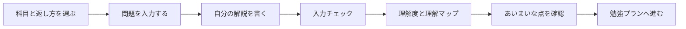

<div align="center">

# TeachBack AI

### 説明して、理解の穴を見つける。

TeachBack AIは、AIに答えを教えてもらうのではなく、学習者がAIに説明することで理解の穴を見つける学習支援ツールです。

[English](./TeachBack%20AI/README_en.md) · [日本語](./TeachBack%20AI/README_ja.md) · [Refined UI](./TeachBack%20AI/index.html) · [Artistic UI](./TeachBack%20AI/index-artistic.html) · [ChatGPT Prompt](./TeachBack%20AI/CHATGPT_SKILL_PROMPT.md)

</div>

<div align="center">


</div>

---

## Overview

一般的なAIチャットは、学習者が質問してAIが答える形になりがちです。TeachBack AIはその向きを反転させました。

学習者が問題を読み、自分の言葉で解説し、その説明をもとに「理解できている点」「あいまいな点」「次に押さえること」「身につけるための勉強」を返します。

この作品の中心は、答えを出すことではありません。学習者が説明できない場所を見つけ、次の学習行動に変えることです。

## Why It Matters

| よくある学習 | TeachBack AI |
| --- | --- |
| 解説を読んで分かった気になる | 自分の説明から理解の穴を見つける |
| 答えを見て終わる | 次に何を復習するかまで出す |
| 教科に関係なく同じ返し方 | 教科ごとに見る観点を変える |
| AIに聞く体験だけ | WebアプリとChatGPTプロンプトの両方で試せる |

## Highlights

- **受け身にしない学習設計**  
  学習者がAIに説明することで、理解しているつもりの部分を可視化します。

- **フィードバック後の行動まで設計**  
  理解度、理解マップ、根拠語句、あいまいな点、勉強プランまで一つの流れで表示します。

- **教科ごとの判定観点**  
  数学は条件・公式・式変形、国語は本文根拠、理科は原因・条件・結果、社会は背景・影響、英語は主語・動詞・文構造を重視します。

- **APIなしで触れるプロトタイプ**  
  HTML / CSS / JavaScriptだけで動き、入力内容は外部に送信されません。

- **UIデザインの比較実装**  
  落ち着いた `Refined UI` と、視覚的に強い `Artistic UI` の2パターンを実装しています。

## Demo

| Variant | File | Design Direction |
| --- | --- | --- |
| Refined UI | [`index.html`](./TeachBack%20AI/index.html) | 白とニュートラルを軸にした、学習アプリらしい洗練されたUI |
| Artistic UI | [`index-artistic.html`](./TeachBack%20AI/index-artistic.html) | 高コントラストで印象に残る、ポートフォリオ向けの表現的UI |
| ChatGPT Prompt | [`CHATGPT_SKILL_PROMPT.md`](./TeachBack%20AI/CHATGPT_SKILL_PROMPT.md) | 同じ学習支援の考え方を生成AIで試すためのプロンプト |

ローカルで見る場合は、このリポジトリをダウンロードして対象のHTMLファイルをブラウザで開くだけです。

## Learning Flow



## Subject Logic

| 教科 | UIカラー | フィードバックで見る観点 |
| --- | --- | --- |
| 国語 | 赤 | 本文の根拠、指示語、接続語、解釈 |
| 数学 | 青 | 条件、公式、定義、式変形、結論 |
| 理科 | 緑 | 原因、条件、結果、法則、観察 |
| 社会 | 黄 | 背景、原因、結果、制度、影響 |
| 英語 | ピンク | 主語、動詞、時制、修飾、文構造 |

## Implemented Features

- 科目別テーマカラー
- フィードバックの返し方切り替え
- 問題入力と解説入力
- `解説の型` テンプレート
- サンプル入力
- 問題・条件・理由・結論の入力チェック
- 未入力時のエラー表示と入力欄フォーカス
- 理解度スコア
- 理解マップ
- 理解できているところ
- 理解があいまいなところ
- 次に押さえること
- フィードバックの根拠語句
- 身につけるための勉強プラン
- PC / タブレット / スマートフォン対応
- オフライン動作

## How It Works

現在のWebアプリ版は、生成AI APIや外部サーバーを使わないルールベースのプロトタイプです。

ブラウザ内のJavaScriptが、入力された問題と解説をもとに次の要素を見ます。

- 問題文の重要語が解説に含まれているか
- 条件や前提に触れているか
- 理由や根拠を説明しているか
- 結論まで書けているか
- あいまいな表現が含まれていないか

入力内容は外部に送信されません。AI搭載済みの完成プロダクトではなく、学習支援AIの体験を検証するための触れるプロトタイプです。

## Tech Stack

```txt
HTML
CSS
JavaScript
```

フレームワークや外部ライブラリは使っていません。

## Project Structure

```txt
TeachBack-AI/
├─ README.md                  # Repository top README
└─ TeachBack AI/
   ├─ index.html              # Refined UI
   ├─ index-artistic.html     # Artistic UI
   ├─ styles.css              # Refined UI styles
   ├─ styles-artistic.css     # Artistic UI styles
   ├─ app.js                  # Feedback logic and screen behavior
   ├─ CHATGPT_SKILL_PROMPT.md # ChatGPT prompt version
   ├─ README.md               # App README
   ├─ README_ja.md            # Japanese README
   └─ README_en.md            # English README
```

## Getting Started

1. このリポジトリをコピーまたはダウンロードします。
2. `TeachBack AI/index.html` または `TeachBack AI/index-artistic.html` をブラウザで開きます。
3. 科目を選び、問題と自分の解説を入力します。
4. `入力する` を押してフィードバックを確認します。

インストール、ビルド、サーバー起動は不要です。

## Design Variants

### Refined UI

落ち着いた配色、読みやすい余白、上品な見出しで、実際の学習アプリとして使いやすい画面を目指したデザインです。

### Artistic UI

太い罫線、強い背景色、高コントラストなカード表現で、ポートフォリオ上でも印象に残る画面を目指したデザインです。

## Future Improvements

- 学習履歴の保存と振り返り
- 問題画像の入力
- 教科ごとの判定精度改善

## Author Note

TeachBack AIは、単にAIを使う作品ではなく、「AIを使うと学習体験をどう変えられるか」を考えて実装したプロトタイプです。

答えを速く得るためのAIではなく、理解を深くするためのAI体験を目指しています。
