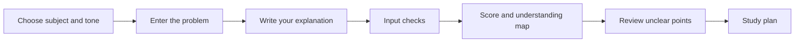

<div align="center">

# TeachBack AI

### Explain it. Find the gaps in your understanding.

TeachBack AI is a learning support prototype that helps learners identify gaps in their understanding by explaining a problem to AI, instead of simply asking AI for the answer.

[English](./README_en.md) · [日本語](./README_ja.md) · [Refined UI](./index.html) · [Artistic UI](./index-artistic.html) · [ChatGPT Prompt](./CHATGPT_SKILL_PROMPT.md)

</div>

<div align="center">


</div>

---

## Overview

Most AI chat experiences start with the learner asking a question and the AI giving an answer. TeachBack AI reverses that flow.

The learner reads a problem, explains the solution in their own words, and receives feedback on what they understand, what is unclear, what to focus on next, and how to study from there.

The core idea is not to provide answers quickly. It is to turn weak explanations into clear review points.

## Why It Matters

| Common Learning Flow | TeachBack AI |
| --- | --- |
| Read an explanation and feel like you understand | Explain it yourself and find the gaps |
| Stop after seeing the answer | Get concrete next study actions |
| Same feedback style for every subject | Subject-specific feedback criteria |
| Only a chat-based AI experience | Web app prototype plus reusable ChatGPT prompt |

## Highlights

- **Active learning by design**  
  The learner explains first, making hidden gaps easier to identify.

- **Feedback that leads to action**  
  The app shows an understanding score, understanding map, evidence keywords, unclear points, and a study plan.

- **Subject-specific criteria**  
  Math focuses on conditions, formulas, and transformations. Japanese focuses on textual evidence. Science focuses on causes, conditions, and results. Social studies focuses on background and effects. English focuses on subjects, verbs, and sentence structure.

- **Touchable prototype without an API**  
  The app runs with HTML, CSS, and JavaScript only. Entered content is not sent outside the browser.

- **Two implemented UI directions**  
  The project includes both a calm `Refined UI` and a high-contrast `Artistic UI`.

## Demo

| Variant | File | Design Direction |
| --- | --- | --- |
| Refined UI | [`index.html`](./index.html) | Calm, polished interface for a practical learning app |
| Artistic UI | [`index-artistic.html`](./index-artistic.html) | High-contrast, expressive interface for portfolio impact |
| ChatGPT Prompt | [`CHATGPT_SKILL_PROMPT.md`](./CHATGPT_SKILL_PROMPT.md) | Prompt version for testing the same learning support behavior with generative AI |

Open the target HTML file in a browser to try it locally.

## Learning Flow



## Subject Logic

| Subject | UI Color | Feedback Focus |
| --- | --- | --- |
| Japanese | Red | Textual evidence, references, conjunctions, interpretation |
| Mathematics | Blue | Conditions, formulas, definitions, transformations, conclusion |
| Science | Green | Causes, conditions, results, laws, observations |
| Social Studies | Yellow | Background, causes, results, systems, effects |
| English | Pink | Subjects, verbs, tense, modifiers, sentence structure |

## Implemented Features

- Subject theme colors
- Feedback tone selection
- Problem and explanation input
- Explanation template
- Sample input
- Input checks for problem, conditions, reasoning, and conclusion
- Error display and input focus for empty required fields
- Understanding score
- Understanding map
- Strengths, gaps, and next points
- Evidence keywords
- Study plan
- Responsive layout for desktop, tablet, and mobile
- Offline behavior

## How It Works

The current web app is a rule-based prototype. It does not use a generative AI API or an external server.

Browser-side JavaScript checks the entered problem and explanation for the following signals.

- Whether important problem terms appear in the explanation
- Whether conditions or assumptions are mentioned
- Whether reasoning or evidence is explained
- Whether the conclusion is clear
- Whether uncertain expressions are included

The entered content is not sent outside the browser. This is not a completed product with generative AI built directly into the web app; it is an interactive prototype for testing the learning support experience.

## Tech Stack

```txt
HTML
CSS
JavaScript
```

No framework or external library is used.

## Project Structure

```txt
TeachBack AI/
├─ index.html                 # Refined UI
├─ index-artistic.html        # Artistic UI
├─ styles.css                 # Refined UI styles
├─ styles-artistic.css        # Artistic UI styles
├─ app.js                     # Feedback logic and screen behavior
├─ CHATGPT_SKILL_PROMPT.md    # ChatGPT prompt version
├─ README.md                  # Main repository README
├─ README_ja.md               # Japanese README
└─ README_en.md               # English README
```

## Getting Started

1. Copy or download this folder.
2. Open `index.html` or `index-artistic.html` in a browser.
3. Select a subject, then enter the problem and your explanation.
4. Click `入力する` to view the feedback.

No installation, build step, or server startup is required.

## Design Variants

### Refined UI

A calm interface with readable spacing, neutral colors, and an elegant heading style. This version is designed to feel like a practical learning app.

### Artistic UI

A more expressive interface with bold lines, high contrast, and strong card shapes. This version is designed to stand out in a portfolio.

## Future Improvements

- Saving learning history for review
- Uploading problem images
- Improving subject-specific evaluation accuracy

## Author Note

TeachBack AI is not just a project that uses AI. It is a prototype that explores how AI can change the learning experience.

Instead of using AI to get answers faster, this project aims to use AI-like feedback to deepen understanding.
